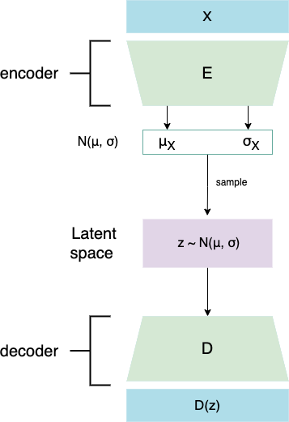
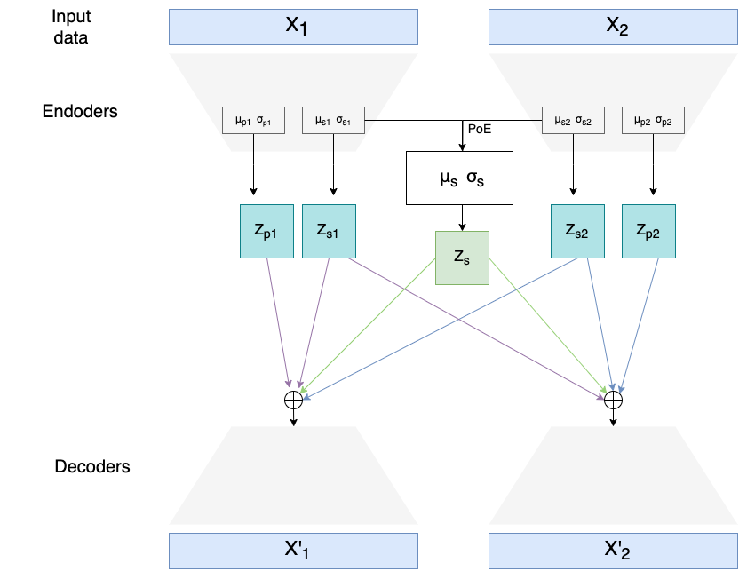
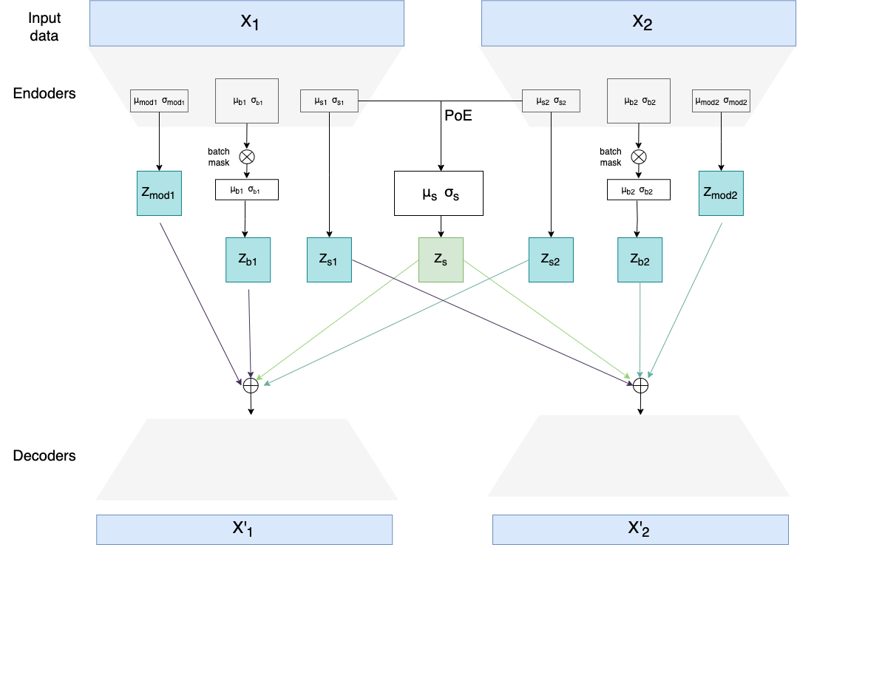

# MVAE
This repository includes code used to obtain results of my Master Thesis "Deep learning-based batch effect correction for for spatial multi-omics data integration" conducted at the [Laboratory of Multi-omic Integrative Bioinformatics (LMIB)](https://gbiomed.kuleuven.be/english/research/50000622/laboratories/laboratory-of-multi-omic-integrative-bioinformatics-lmib/laboratory-of-multi-omic-integrative-bioinformatics-lmib) at KU Leuven.

It defines two multimodal variational autoencoders and one unimodal, which can be seen in the section below. Multimodal VAEs were used to integrate transcriptomics (RNA) and lipidomics datasets and perform batch effect correction on them (remove sample-specific technical/biological variability introduced by eg. using different machines/technologies to obtain data). Multimodal data integration is done through the Product of Experts (PoE) network.

The code defines also a novel loss function component called Batch Integration loss (in the code described as "LISI loss" as it's based on the LISI metric). Unimodal VAE was used mostly for testing the performance of Batch Integration loss before implementing it also for multimodal models.


Under each model-specific directory (`src/vae`, `src/smvae`, `src/mvae`) there is a set of files:
* `model.py` defines the architecture of each model (`torch.nn.Module`s and layers)
* `train.py` includes training/testing functions
* `dataloader.py` includes function that take MuData or AnnData objects (used to store multimodal/unimodal omics expression matrices) and transform them into `torch.utils.data.dataset.Dataset`
* `diagnostics.py` groups functions for plotting embeddings and classification scores
* `loss_calculator.py` includes the loss function (MSE, Kullback-Leibler divergence, and Batch Integration loss)


Notebooks `SMVAE-thesis` and `MVAE-thesis` include training of the models using different hyperparameters. `Benchmark prostate...` notebooks compare results obtained with MVAE with state-of-art batch effect correction methods. 

## Models

### VAE


### Simplified Multimodal Autoencoder


### Multimodal autoencoder


## Setup
Easiest way to setup this project locally is to use [conda](https://docs.conda.io/en/latest/). File `mvae.yml` includes all packages necessary to run the code, so you can setup the environment with:
```
conda env create -f mvae.yml
```
The code assumes availability of CUDA on the server and if you want to run the code on CPU only, certain pytorch functions need adding of an additional argument `cuda=False`.