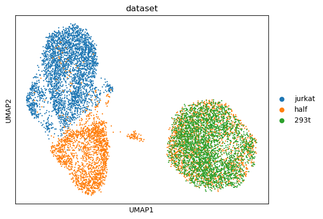
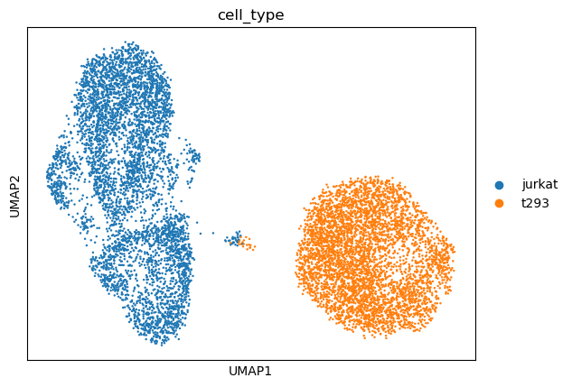
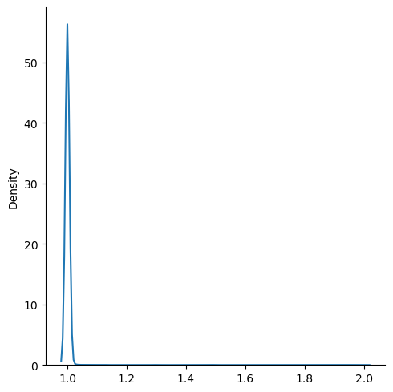
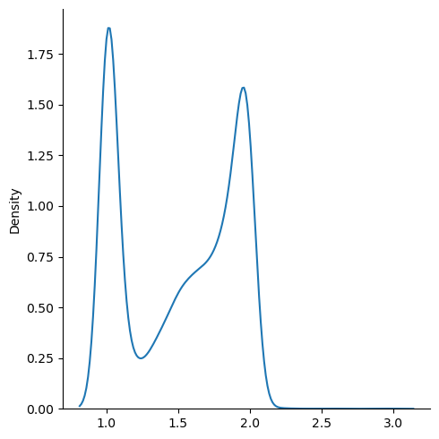
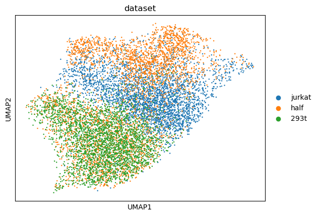
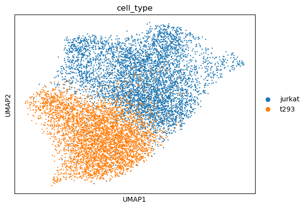
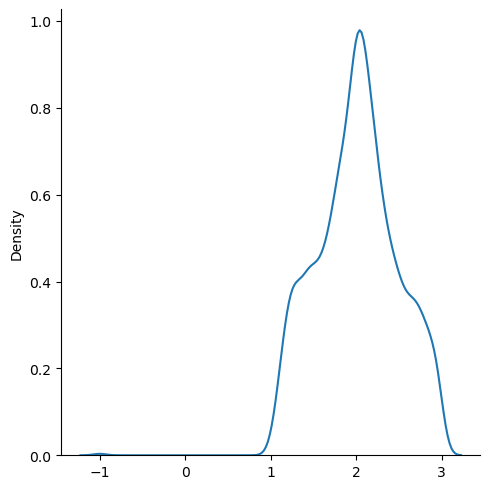
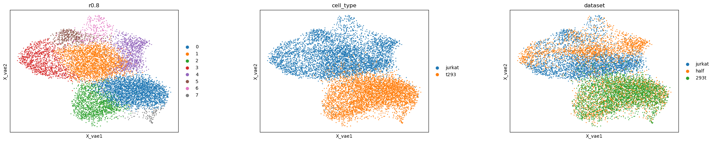
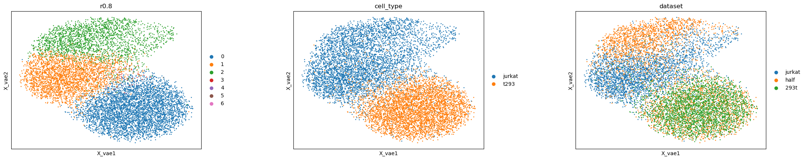
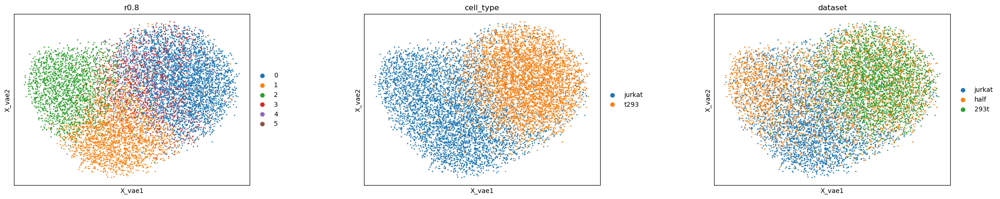

# VAE with LISI: benchmark Jurkat&293T

Reproduction of "Quantifying performance in cell-line data" section from [Fast, sensitive and accurate integration of single-cell data with Harmony
](https://www.nature.com/articles/s41592-019-0619-0). 

## Results from paper
They analyse a concatenation of 3 datasets: pure Jurkat cells, pure 293T, and a 50:50 mix of both*. They calculate iLISI (integration LISI) and cLISI on the dataset. iLISI assesses integration by calculating LISI with respect to original datasets (so whether the cell came from pure Jurkat, pure 293T or mixed dataset). cLISI is a LISI with respect to cell type and measures accuracy.

Then they apply Harmony and recalculate the metrics.

The results from the paper:

(For some reason their iLISI is max 2.0 even tho we're dealing with 3 dataset origins... Maybe they're measuring it per cluster :thinking_face)

## Our results
We pre-process the data with the same steps as the authors of the paper and calculate iLISI and cLISI. Then we apply VAE with LISI and recalculate the metrics.

### Before

### After

### After (beta=0.001, top 1000 genes)

### After (beta=0.001, top 10k genes)

### After (beta=0.01, top 10k genes)

*Datasets come from: [Zheng et al, “Massively parallel digital transcriptional profiling of single cells”](http://www.nature.com/articles/ncomms14049).
