# VAE with LISI benchmark immune human

Analysed dataset comes from [2021 Benchmarking atlas-level data integration in single-cell genomics](https://www.nature.com/articles/s41592-021-01336-8) and consists of data from 5 separate datasets containing immune cells human bone marrow and peripheral blood.

Joined dataset has 33506 observations and 12303 genes.

The authors shared a ready AnnData object via [Figshare](https://doi.org/10.6084/m9.figshare.12420968). More detailed description of the datasets and scripts joining them can be found [here](https://github.com/theislab/scib-reproducibility/tree/main/notebooks/data_preprocessing/immune_cells). The objects has been additionally normalized with `sc.pp.normalize_total(adata, target_sum=1e4)`.

In the joined dataset there are several sources of inter-batch variation:
* different donors
* different protocols: 10X (v1, v2, v3) and smart-seq2
* different tissues (bone marrow, peripheral blood)

There is also an option of adding the same cell types from mouse datasets to obtain an additional inter-species variation.

## Raw data
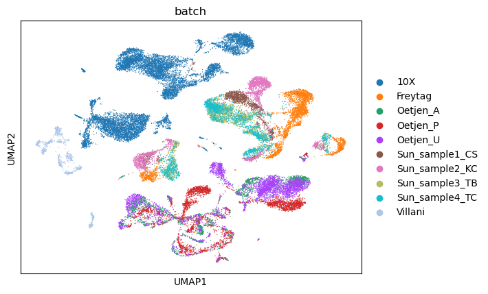
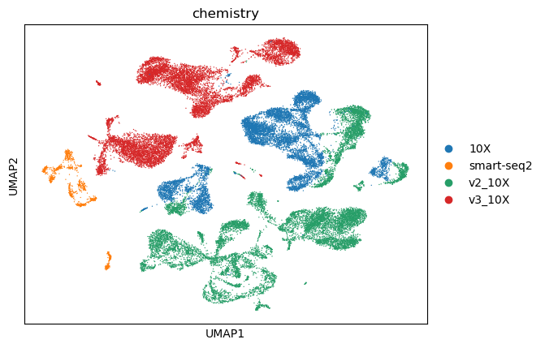

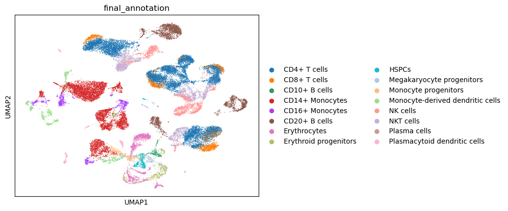

## After training
Training with kl beta = 0.01, lr = 1e-4

### Model: VAE with loss = MSE + 0.01 * sum(1/LISI(batch))
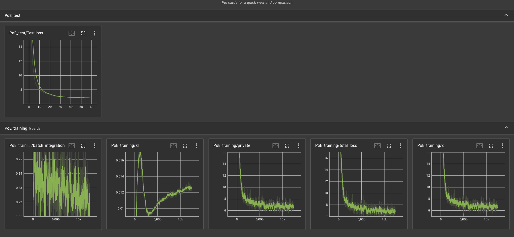

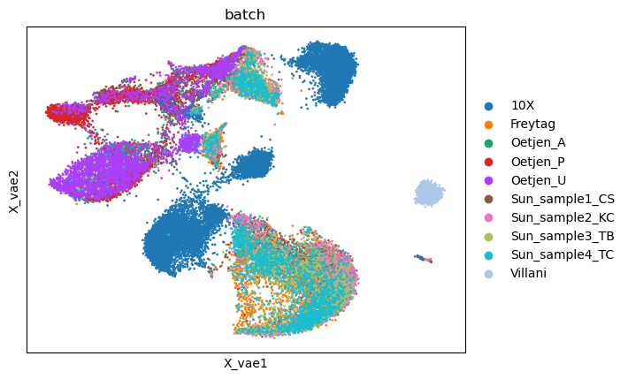
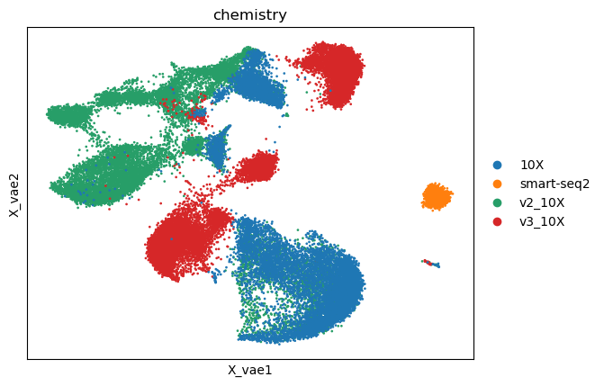
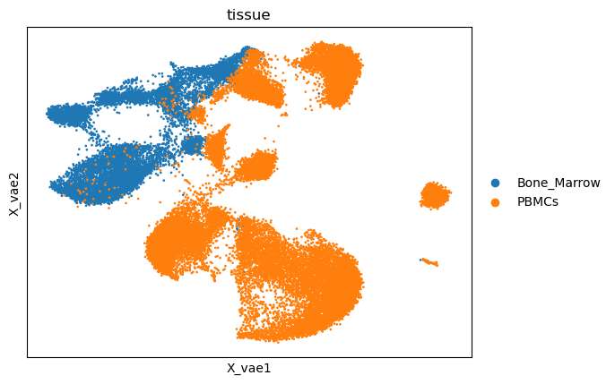
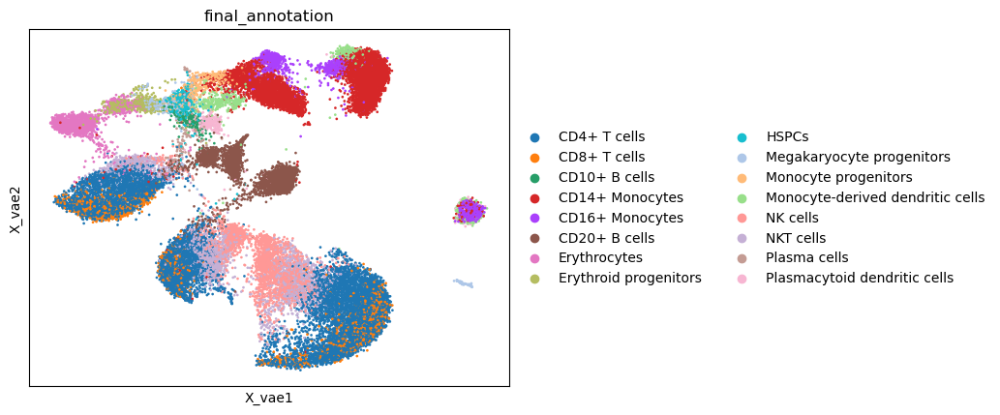

### Model: VAE with loss = MSE + 0.1 * sum(1/LISI(batch))
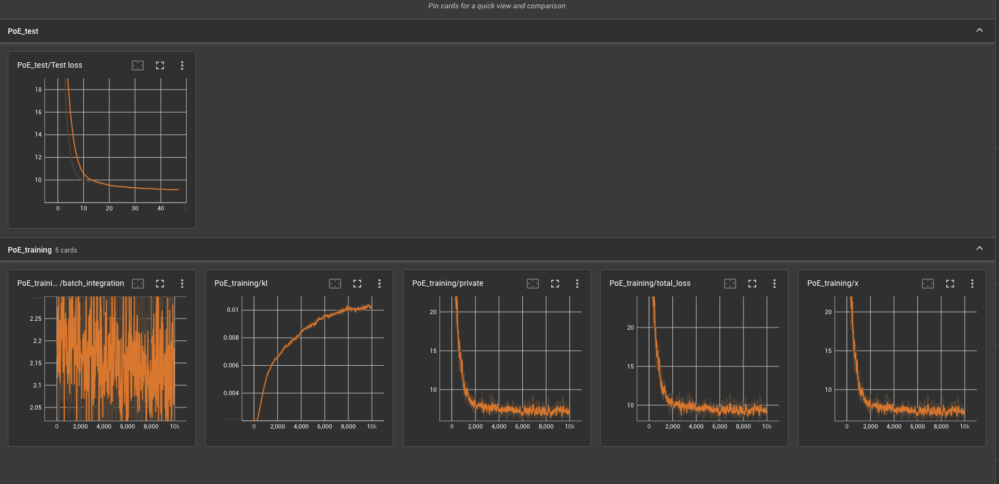

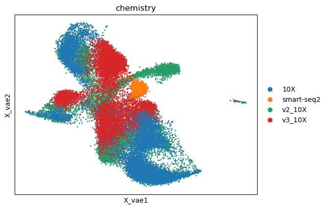

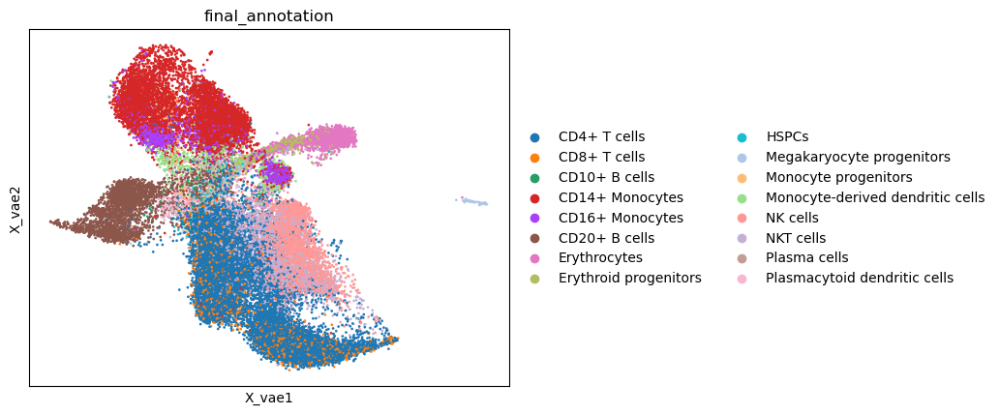

### Model: VAE with loss = MSE + 0.01 * 1/sum(1/LISI(cell_type))
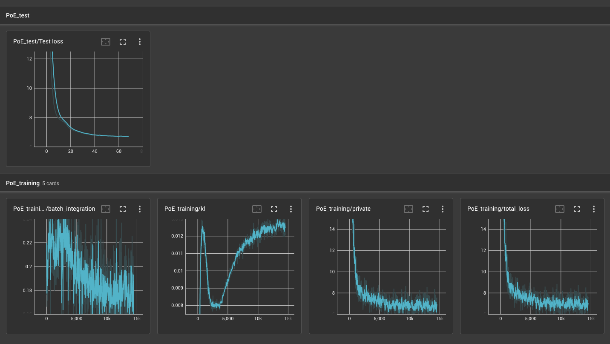

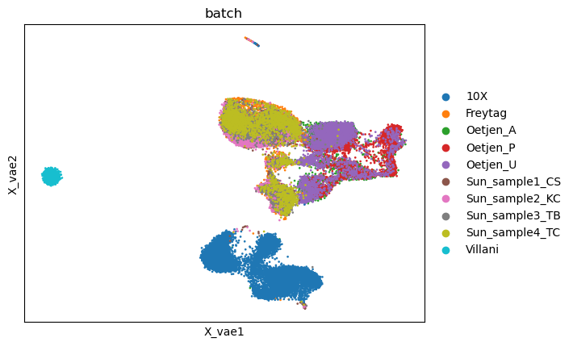
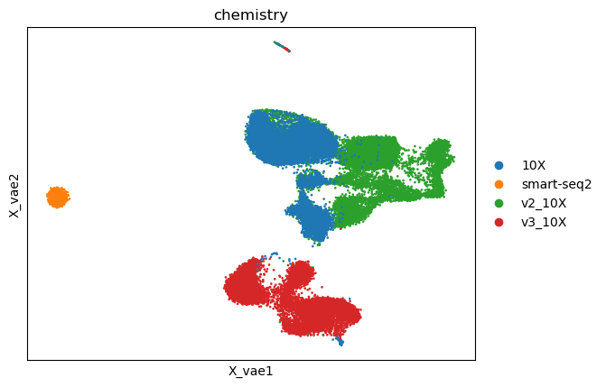
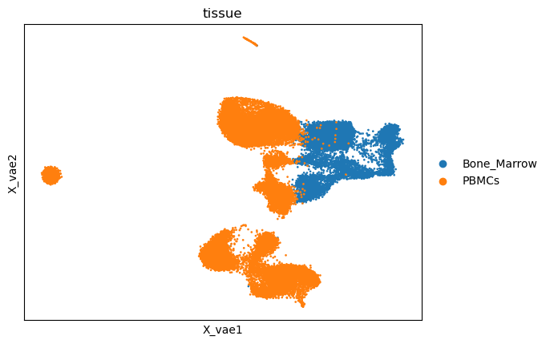
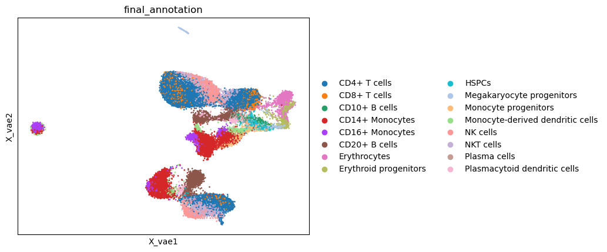

### Model: VAE with loss = MSE + 0.01 (1/sum(1/LISI(cell_type)) + sum(1/LISI(tissue)) + sum(1/LISI(batch)) + sum(1/LISI(chemistry)))
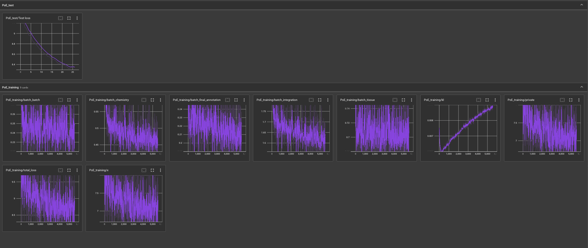

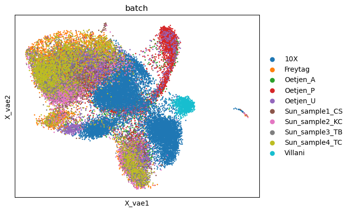
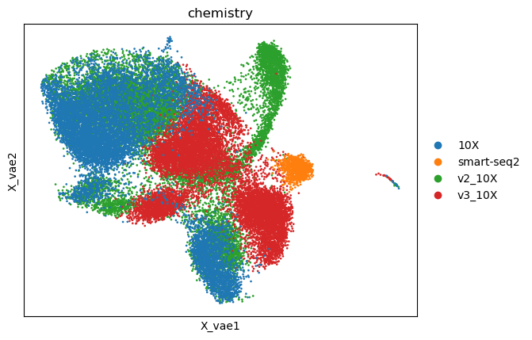
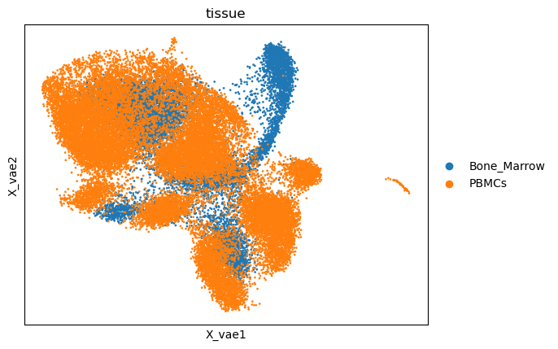
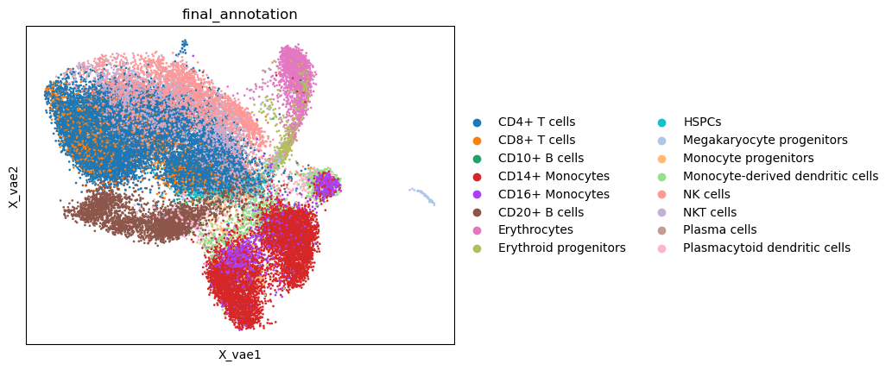

## Paper
Embeddings from best performing methods according to the paper:

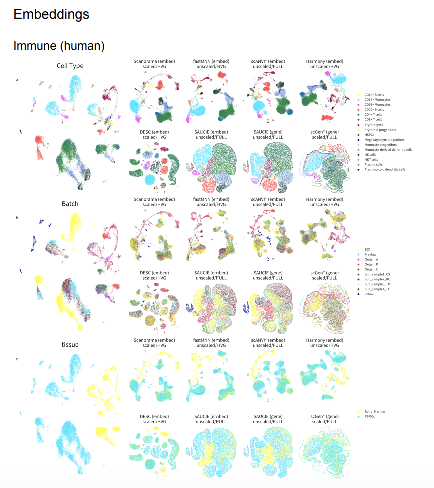

Note that scANVI and scGen chosen here as best methods require cell annotations!